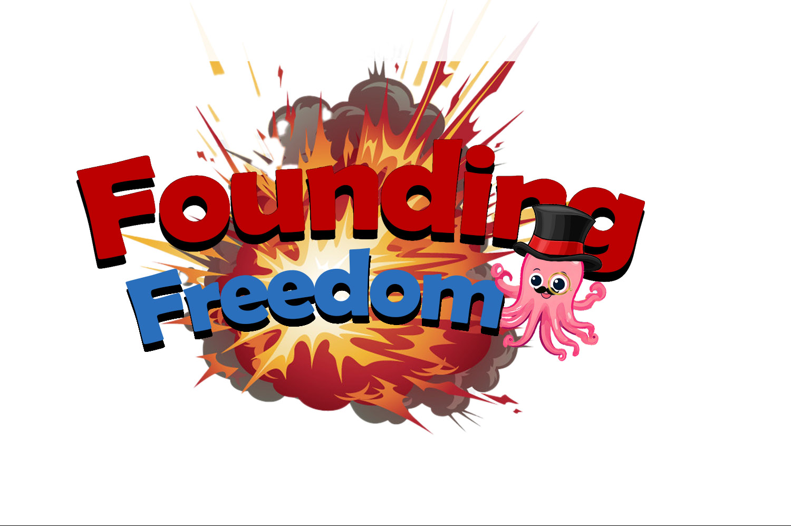

## 🔴How to Play🔴

Playing Founding Freedom is a simple flash styled game with controls being **w** **a** **s** **d** to move around the map. When fighting colonists or other entities select an attack with **enter** or **e**

## 🔴Story of Game🔴

"Founding Freedom" delves into the real-life events of the American Revolution, records of their quest for freedom, justice, and liberation from British colonization will forever be immortalized. Join the unforgettable cast of heroes; George Washington, Jefferson, Adams, Hamilton, and Madison, as they embark on a daring journey across the seas to challenge the British mandate. Brace yourself for an epic tale of courage, camaraderie, and tomfoolery as these unlikely champions defy the odds in the pursuit of spreading democracy.

## 🔴Roles🔴

#### * Project manager - Conner
I was responsible for the overall managment of the group for our Founding Freedom game. Our team was one of the most talented and cooperative I have worked with on a project by far. Updating them on recent life events that coorelated to my motivation towards anything was met with warm responses that really lifted up my mood. Sending updates every night to Kerney and the read me you see before you were my main jobs as project manager. I could not of done this withought mentioning Luke who really stepped up when I was at my lowest.

#### * Curse Lord - Goose
I was responsible for making the UI and giving the game graphics using Ncurses. The files I worked on include player.cc, ui.cc, attributes.cc, cutscenes.cc, combat.cc, and dialouge.cc. As well as jjkcurselord.h which contains declarations for all functions used, and maps.h which as a list of vector<string>'s that contain the game's maps. Everything runs off of a simple game loop in main.cc that repeatedly takes player input and updates the screen with either the player's new position on the map or an event. These events can be either cutscenes or combat scenarios that are call by a function checking the player's position between every input.

#### * Thread Lord - James
I was responsible for the thread safety of the game. Created a class to take manage input with a thread but when it came to integrating, me and sabrina had difficulty applying it into the game. We thought it was the multi threading issue at first therefore I created another thread safety class and tested that out and the safety worked but still had the same issue of having to press enter for input to be registered, pressing the key twice to reigster the input, or not registering certain movements.

#### * DJ Bridges - Kaitlyn
I messed around with music making programs on 5/4. I had trouble learning most of them, so I settled with Garageband. 5/5 was when I began making songs and uploading them to the repo. I used the same song for all fight themes and switched the type of instrument, the rest of the songs are unique. Had trouble uploading wav files to Bridges initially. Worked with Taste Tester and found out wav files should be 44100 hz, fully compressed, and shortened to around 30 seconds. Links to songs on Bridges were put at the beginning of game cutscenes.

#### * Inheritor of Suffering - Tanner
#### * Socketroth - Shadow (Toovey)
#### * Taste Tester - Luke
Testing - Luke Olson (test.cc, music_test.cc):
I primarily worked with the inheritance code to make sure that the inheritance structure was working correctly. The first time around, I did a few tests and made reccomendations on the smaller functions used by other functions, like the getters and setters for health and damage. I also gave reccomendations on what to change in the other functions and inheritance structure regarding where certain function were defined in the inheritance structure. The second time around, after the inheritance person implemented some of the changes I reccomended and communicated with the mapping and scriptwriters, I went back and did another thorough round of testing. This time, I ran every method on every single hero and every single monster, creating my own custom analysis function to diagnose the random bug in run_ai() as well as the coordinate order in function arguments snafu. These issues were promptly fixed. Networking, threading, and overall integration roles convened at the last minute, so I did not interfere with their process by inserting myself. However, I did assist with troubleshoointg of uploading the audio files to Bridges on Sunday night by trying to run it myself, and reccomending 44.1 khz and 30s wav files.

#### * Integration Specialist - andromeda (S. Pena)
I went to the TC last weekend to try and anticipate my part( wasn't very helpful though), I attempted some brainstorming, messaged shadow yesterday and today about his part to try and figure out implementation, also had some private dms with James to troubleshoot stuff earlier, spent 2 hours in TC tonight trying to figure everything out (wasn't very helpful again, but more so than last weekend), made the diagram of how all the pieces work together ( uploaded to GitHub).

#### * Screen Writer - Omar
I was the script writer so my role didnt have much coding involved in it instead i was more involved with the creative process. I learnt many things such as how to work with multiple people and how to adjust a creative narrative to better fit the capabilities of the team. Honesty the project was fun and the entire team went above and beyond so kudos to them.

